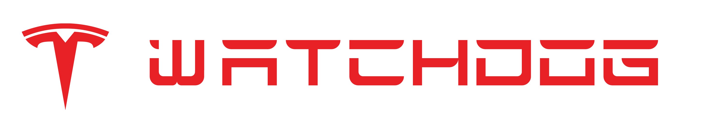

<p align="center" style="text-align: center">
  <a href="https://github.com/LukenSkyne/Tesla-Watchdog">
    
  </a>
</p>

<h3 align="center">Tesla Watchdog</h3>
<p align="center">
    actively watches over your tesla and locks it automatically
</p>

<div align="center">

<a href="https://github.com/LukenSkyne/Tesla-Watchdog/blob/main/LICENSE"></a>

</div>

## About

I am fairly happy with the Walk-Away Door Lock feature, but there have been edge cases where it didn't work as expected.
Sometimes the phone key doesn't work, and we fall back to using Remote Start.
In these situations you are required to lock the doors manually.

This app aims to solve these issues and provide the peace of mind that your car is always locked. 

## Build & Run

For the app to connect to the Tesla API, it requires an access and refresh token from your account.
You can fetch these with tools like the [Tesla token fetcher](https://tesla-token.smartcharge.dev/).
I was just too lazy to integrate the OAuth flow into this app, but the good news is that you only do this once.

For a minimal run configuration, duplicate the `tesla.yaml.example` and rename it to `tesla.yaml`, replacing the two tokens with your own.
You can ignore the `mainVehicle` value and let the app set it automatically for now.

After installing the dependencies with `go get .` you can build and run the app as follows:

```bash
# building the app for your current system
go build

# running on linux
chmod +x ./tesla-watchdog
./tesla-watchdog
```

If you like to be informed about errors and warnings via discord, you can duplicate the `.env.example` and fill in a bot token + channel id.
This feature is mostly for myself to get notified when something breaks.

## Acknowledgements

* [Tim Dorr](https://tesla-api.timdorr.com/) for documenting the Tesla API
* [Tesla](https://www.tesla.com/) for providing the service

## Disclaimer

This project is not affiliated, authorized or endorsed by Tesla, and all associated properties are trademarks or registered trademarks of Tesla, Inc.
